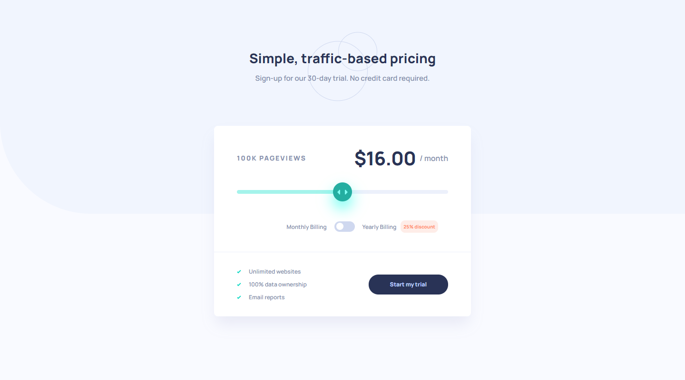

# Frontend Mentor - Interactive pricing component solution

This is a solution to the [Interactive pricing component challenge on Frontend Mentor](https://www.frontendmentor.io/challenges/interactive-pricing-component-t0m8PIyY8). Frontend Mentor challenges help you improve your coding skills by building realistic projects.

## Table of contents

- [Overview](#overview)
  - [The challenge](#the-challenge)
  - [Screenshot](#screenshot)
  - [Links](#links)
- [My process](#my-process)
  - [Built with](#built-with)
  - [What I learned](#what-i-learned)
- [Author](#author)

## Overview

### The challenge

Users should be able to:

- View the optimal layout for the app depending on their device's screen size
- See hover states for all interactive elements on the page
- Use the slider and toggle to see prices for different page view numbers

### Page view and pricing totals

Here are the different page view ranges and the corresponding monthly price totals:

- 10K pageviews / $8 per month
- 50K pageviews / $12 per month
- 100K pageviews / $16 per month
- 500k pageviews / $24 per month
- 1M pageviews / $36 per month

If the visitor switches the toggle to yearly billing, a 25% discount should be applied to all prices.

### Screenshot

### Links

- Solution URL: (https://www.frontendmentor.io/solutions/responsive-pricing-calculator-with-javascript-_h-0Hs-le)
- Live Site URL: (https://lm-interactive-price-component.netlify.app/)

## My process

### Built with

- Semantic HTML5 markup
- CSS custom properties/vars
- Desktop-first workflow
- Vanilla javascript

### What I learned

I learnt how to make a custom range slider (I don't think I've EVER used one in my life anyway), which was fun. I then had to think about the javascript side as it's quite heavy on calculations (hardest one yet I mean from the challenges), so I had to think how I would store the pricing data, and then manipulate it to apply the 25% discount etc...

I split up main functionalities into functions so they could be called whenever, making them reusable.

This was a really fun challenge, as I've never made a pricing calculator like this before!

## Author

- Website - [Leon Michalak](https://www.leonmichalak.tech)
- Frontend Mentor - [@NinjaInShade](https://www.frontendmentor.io/profile/NinjaInShade)
- Instagram - [@lmdeveloper](https://www.instagram.com/lmdeveloper/)
